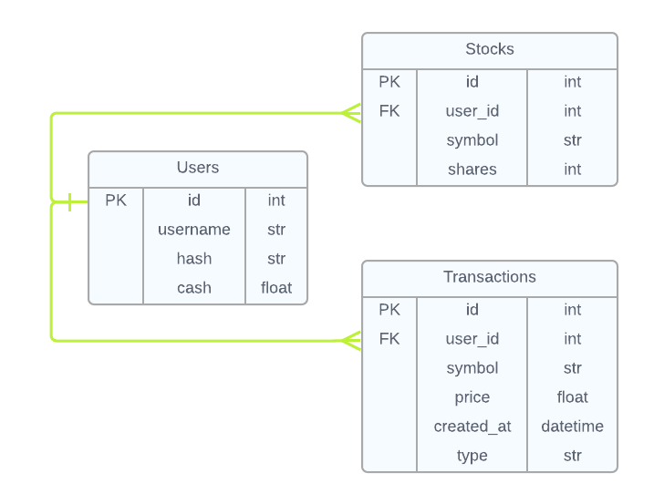

# C$50 Finance

C$50 Finance, a web app via which you can manage portfolios of stocks. Not only will this tool allow you to check real stocks’ actual prices and portfolios’ values, it will also let you buy and sell stocks by querying [IEX](https://iextrading.com/developer/) for stocks’ prices.

## Setup

### 1. Install the project dependances
```
$ pip3 install -r requiremants.txt
```

### 2. Add [IEX](https://iextrading.com/developer/) API_KEY to your environment variables

### 3. Run the flask server
```
$ python3 app.py
```

### 4. Now check http://localhost:5000

## Database ERD
